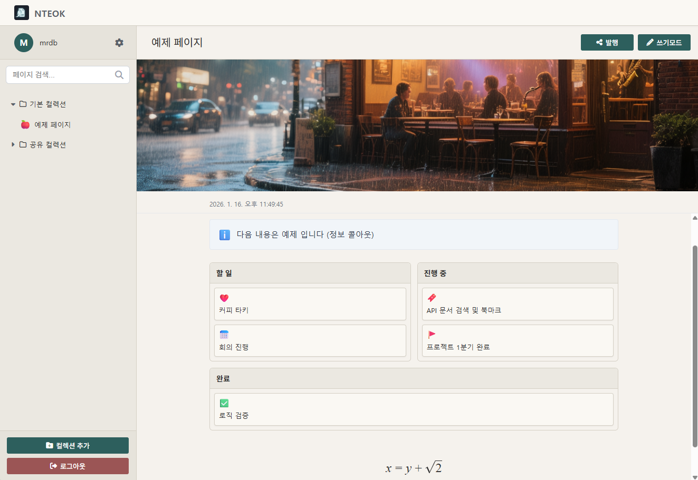

# NTEOK

Self-Hostable Web-Based Note-Taking Application

---

**[한국어](README.md)** | **[日本語](README.jp.md)** | **English**

---



## Overview

**NTEOK** is a compound word combining the Korean words "Neok (넋, soul)" and "Note". It is a multi-user note-taking web application built on Node.js and MySQL, featuring block-based markdown editing and End-to-End encryption.

### Key Features

- **Markdown Editor**: Tiptap-based block editor with various block type support
- **Diverse Block Types**: Paragraph, heading, lists, checklist, image, code, math, board, callout, toggle, tab, file, calendar, YouTube embed, and more
- **End-to-End Encryption**: AES-256-GCM client-side encryption
- **Storage Sharing**: User collaboration and link sharing
- **Hierarchical Structure**: Parent-child page relationships
- **Multiple Authentication**: TOTP 2FA and Passkey (WebAuthn/FIDO2) support
- **Backup/Restore**: Complete data backup and recovery in ZIP format
- **Real-time Synchronization**: Real-time page content sync via WebSocket + Yjs
- **Page Comments**: Page-level comments for collaborative communication
- **Cover Images**: Page cover image settings and sorting
- **HTTPS Auto Certificate**: Let's Encrypt + DuckDNS integration
- **Responsive Design**: Optimized for mobile, tablet, and desktop
- **Self-Hosting**: Independent server operation

---

## Core Features

### User Management
- Registration and login system
- TOTP two-factor authentication (Google Authenticator, Authy, etc.)
- **Passkey Authentication** (WebAuthn/FIDO2 - biometric, hardware tokens)
- Session-based authentication
- Account deletion

### Note Editing
- **Block Types**: Paragraph, Heading (H1-H6), Lists (bullet/ordered), Image, Blockquote, Code block, Horizontal rule, LaTeX math, board, callout, toggle, tab, file, calendar, YouTube embed, and more
- **Inline Formatting**: Bold, italic, strikethrough, text color
- **Alignment Options**: Left, center, right, justify
- **Image Features**: Image block alignment and caption support (captioned image block)
- **Special Blocks**:
  - **Board View**: Display pages in card format
  - **Callout**: Highlight messages and notifications
  - **Toggle**: Collapsible content sections
  - **Tab**: Display content organized in multiple tabs
  - **File**: Attach and download files
  - **Calendar**: Display data in calendar format
  - **YouTube**: Embed YouTube videos directly
  - **Math**: LaTeX math formulas rendered with KaTeX
- **Slash Commands**: Type `/` to switch block types
- **Keyboard Shortcuts**: `Ctrl+S` / `Cmd+S` to save

### Storages and Pages
- Group pages by storage
- Hierarchical page structure (parent-child relationships)
- Page icon settings (170 Font Awesome icons, 400 emoji)
- **Page Cover Images**: Set default or user-uploaded cover images
- Auto-sort by last modified time
- Drag-and-drop sorting (planned)

### Security Features
- **E2EE Encryption**: AES-256-GCM encryption
- **Client-Side Encryption**: Only encrypted data sent to server
- **TOTP 2FA**: Time-based one-time password
- **Passkey Security**: WebAuthn standard-based strong authentication
- **CSRF Protection**: SameSite cookie settings
- **Session Management**: Secure cookie-based authentication

### Data Management
- **Backup/Restore**: Full backup and recovery of storages and pages in ZIP format
- **Data Export**: Convert page content to HTML format
- **Data Import**: Recover and restore previous backup data
- **PDF Export**: Convert page content to PDF format
- **Page Publishing**: Share pages via public links (read-only)

### Real-time Synchronization
- **WebSocket-based Sync**: Real-time page change synchronization
- **Collaborative Editing**: Support simultaneous editing by multiple users (Yjs-based)
- **Data Consistency**: Conflict resolution and improved sync accuracy

### Collaboration Features
- **User Sharing**: Share storages with specific users
- **Permission Management**: READ, EDIT, ADMIN permission levels
- **Encrypted Page Sharing**: Share permission settings for encrypted pages
- **Page Comments**: Comment on pages for collaborative communication
- **Login Logs**: Track login history for account security

---

## Technology Stack

### Backend
- **Runtime**: Node.js 18+
- **Framework**: Express 5.x
- **Database**: MySQL 8.x
- **Authentication**: bcrypt (password hashing), speakeasy (TOTP), @simplewebauthn (Passkey)
- **Security**: cookie-parser, CSRF tokens, SameSite cookies
- **Backup**: archiver (ZIP creation), adm-zip (ZIP extraction)
- **Real-time**: WebSocket (ws), Yjs (CRDT-based synchronization)
- **HTTPS**: acme-client (Let's Encrypt), dotenv (environment variables)

### Frontend
- **Core**: Vanilla JavaScript (ES6+ modules)
- **Editor**: Tiptap v2 (StarterKit, TextAlign, Color, Mathematics, ImageWithCaption)
- **Math Rendering**: KaTeX
- **Encryption**: Web Crypto API (AES-256-GCM)
- **Passkey**: @simplewebauthn/browser (WebAuthn)
- **Real-time Sync**: Yjs, WebSocket
- **Icons**: Font Awesome 6
- **Styling**: Pure CSS (responsive design)

---

## Installation and Setup

### Prerequisites

- Node.js 18 LTS or higher
- MySQL 8.x server
- npm package manager

### 1. Create Database

```sql
CREATE DATABASE nteok
  CHARACTER SET utf8mb4
  COLLATE utf8mb4_unicode_ci;
```

### 2. Environment Configuration (Setup Script)

Windows:
```bash
setup.bat
```

Linux/macOS:
```bash
chmod +x setup.sh
./setup.sh
```

The script will interactively prompt for:
- Database host, port, username, password
- Admin account ID/password (auto-generated if not provided)
- HTTPS settings (DuckDNS)

### 3. Install Dependencies and Run

```bash
npm install
npm start
```

Server runs at `http://localhost:3000`.

### 4. Initial Login

Login with the admin account configured by the setup script.

> Security note: Set a strong password and rotate it as needed after the first login.

---

## HTTPS Auto Certificate Setup

NTEOK automatically issues and manages HTTPS certificates by integrating DuckDNS with Let's Encrypt.

### Features

- ✅ **Auto Certificate Issuance**: Let's Encrypt DNS-01 Challenge
- ✅ **Auto Renewal**: Automatic renewal 30 days before expiration (24-hour interval check)
- ✅ **DuckDNS Integration**: TXT record-based domain validation
- ✅ **HTTP/HTTPS Auto Switching**: Automatically select protocol based on configuration
- ✅ **Pure npm Libraries**: No external daemons like Certbot required

### Setup Instructions

#### 1. Create DuckDNS Account

1. Visit [DuckDNS](https://www.duckdns.org) and create an account
2. Register your desired domain (e.g., `mynteok.duckdns.org`)
3. Connect your server's public IP address to the domain
4. Copy your API token

#### 2. Environment Variables Setup

Add the following to `.env` file:

```bash
# DuckDNS domain (must end with .duckdns.org)
DUCKDNS_DOMAIN=mynteok.duckdns.org

# DuckDNS API token
DUCKDNS_TOKEN=xxxxxxxx-xxxx-xxxx-xxxx-xxxxxxxxxxxx

# Let's Encrypt certificate email (optional)
CERT_EMAIL=admin@example.com

# HTTPS port (default: 3000, recommended: 443)
PORT=443

# HTTP → HTTPS auto redirect (optional)
ENABLE_HTTP_REDIRECT=true
```

#### 3. Run Server

```bash
npm start
```

Server startup automatically performs:

1. **Check existing certificate**: Reuse if valid certificate exists
2. **Issue certificate**: Request new certificate from Let's Encrypt if missing or expired
3. **DNS Challenge**: Set TXT record via DuckDNS API
4. **Start HTTPS server**: Run HTTPS server with issued certificate

#### 4. Certificate Storage Location

Issued certificates are stored in `certs/` directory:

```
certs/
├── account-key.pem       # ACME account private key
├── domain-key.pem        # Domain private key
├── certificate.pem       # Certificate
├── fullchain.pem         # Full chain (certificate + intermediate)
└── chain.pem             # Intermediate certificate chain
```

### Important Notes

- **Public IP Required**: Let's Encrypt DNS Challenge only works with public IPs
- **Domain Format**: DuckDNS domain must end with `.duckdns.org`
- **Port Permissions**: Admin rights may be required when using ports 80/443
- **DNS Propagation Time**: First certificate issuance takes approximately 2-3 minutes
- **Auto Renewal**: Certificate automatically renews 30 days before expiration if server is running

### Fallback Mode

If HTTPS certificate issuance fails, it automatically falls back to HTTP mode:

```
❌ HTTPS certificate issuance failed. Falling back to HTTP mode.
⚠️  NTEOK app running on HTTP: http://localhost:3000
```

---

## API Endpoints

### Authentication
- `POST /api/auth/login` - Login
- `POST /api/auth/logout` - Logout
- `POST /api/auth/register` - Register
- `GET /api/auth/me` - Current user info
- `DELETE /api/auth/account` - Delete account

### Two-Factor Authentication
- `POST /api/auth/totp/setup` - Setup TOTP
- `POST /api/auth/totp/verify` - Verify TOTP
- `DELETE /api/auth/totp/disable` - Disable TOTP

### Passkey (WebAuthn)
- `GET /api/passkey/status` - Check Passkey status
- `POST /api/passkey/register/options` - Generate registration options
- `POST /api/passkey/register/verify` - Verify registration
- `POST /api/passkey/authenticate/options` - Generate authentication options
- `POST /api/passkey/authenticate/verify` - Verify Passkey authentication

### Storages
- `GET /api/storages` - List storages
- `POST /api/storages` - Create storage
- `PUT /api/storages/:id` - Update storage name
- `DELETE /api/storages/:id` - Delete storage
- `GET /api/storages/:id/collaborators` - List collaborators
- `POST /api/storages/:id/collaborators` - Add collaborator
- `DELETE /api/storages/:id/collaborators/:userId` - Remove collaborator

### Pages
- `GET /api/pages` - List pages
- `GET /api/pages/:id` - Get page
- `POST /api/pages` - Create page
- `PUT /api/pages/:id` - Update page
- `DELETE /api/pages/:id` - Delete page
- `GET /api/pages/covers/user` - List user cover images

### Backup/Restore
- `POST /api/backup/export` - Export data (ZIP)
- `POST /api/backup/import` - Import data (ZIP)

### Page Comments
- `GET /api/comments` - List comments
- `POST /api/comments` - Create comment
- `DELETE /api/comments/:id` - Delete comment

### Theme Settings
- `GET /api/themes` - Get user theme
- `PUT /api/themes` - Change theme setting

### Published Pages
- `GET /api/pages/:id/publish` - Get publish status
- `POST /api/pages/:id/publish` - Create publish link

---

## Security Considerations

### End-to-End Encryption
- Client-side AES-256-GCM encryption
- Only users possess encryption keys
- Server stores only encrypted data

### Two-Factor Authentication
- TOTP-based time-synchronized authentication
- Easy setup via QR code
- Backup codes (planned)

### Passkey Security
- WebAuthn/FIDO2 standard-based strong authentication
- Biometric (fingerprint, face recognition) and hardware token support
- Phishing attack prevention with strong encryption

### Session Security
- SameSite=Strict cookie settings
- CSRF token verification
- Session timeout management

### Data Backup Security
- Encrypted backup file storage
- Data integrity verification
- Restricted access permissions

---

## Design Concept

Modern reinterpretation of traditional Korean hanji (paper) minimalist aesthetics.

### Color Palette
- **Background**: Hanji-inspired cream/beige tones (#faf8f3, #f5f2ed)
- **Sidebar**: Dark beige tones (#ebe8e1)
- **Text**: Ink-like colors (#1a1a1a, #2d2d2d)
- **Accent**: Dark teal (#2d5f5d)

### Design Principles
- Restrained spacing and clean layout
- Minimalist interface with straight lines
- Responsive design for all devices
- Optimal readability with line-height of 1.7

---

## Project Structure

```
NTEOK/
├── server.js              # Express server entry point
├── websocket-server.js    # WebSocket server (real-time sync)
├── cert-manager.js        # HTTPS certificate auto-issue module (Let's Encrypt)
├── network-utils.js       # Network utilities (IP, location info)
├── security-utils.js      # Security utilities
├── package.json           # Project dependencies
├── .env.example           # Environment variables example
├── icon.png               # Application icon
├── example.png            # README screenshot
├── LICENSE                # ISC License
├── certs/                 # SSL/TLS certificate storage (auto-created)
├── data/                  # Data repository
├── covers/                # Cover image repository
│   ├── default/           # Default cover images
│   └── [userId]/          # User cover images
├── themes/                # CSS themes
│   ├── default.css        # Default light theme
│   └── dark.css           # Dark theme
├── languages/             # i18n multi-language files
│   ├── ko-KR.json         # Korean
│   ├── en.json            # English
│   └── ja-JP.json         # Japanese
├── public/                # Client files
│   ├── index.html         # Main application (after login)
│   ├── login.html         # Login page
│   ├── register.html      # Registration page
│   ├── shared-page.html   # Public page view
│   ├── css/
│   │   ├── main.css       # Main styles
│   │   ├── login.css      # Login styles
│   │   └── comments.css   # Comments feature styles
│   └── js/                # Frontend JavaScript modules
│       ├── app.js         # Main application logic
│       ├── editor.js      # Tiptap editor initialization
│       ├── pages-manager.js         # Page management
│       ├── encryption-manager.js    # E2EE encryption management
│       ├── storages-manager.js      # Storage management
│       ├── settings-manager.js      # User settings management
│       ├── backup-manager.js        # Backup/restore management
│       ├── sync-manager.js          # WebSocket real-time sync
│       ├── passkey-manager.js       # Passkey/WebAuthn management
│       ├── totp-manager.js          # TOTP 2FA management
│       ├── login.js                 # Login page logic
│       ├── register.js              # Registration page logic
│       ├── crypto.js                # Web Crypto API wrapper
│       ├── pdf-export.js            # PDF export
│       ├── comments-manager.js      # Page comments feature
│       ├── account-manager.js       # Account management
│       ├── cover-manager.js         # Cover image management
│       ├── drag-handle-extension.js # Drag handle extension
│       ├── publish-manager.js       # Page publishing management
│       ├── subpages-manager.js      # Page hierarchy management
│       ├── shared-page.js           # Public page view logic
│       ├── login-logs-manager.js    # Login logs management
│       ├── board-node.js            # Board view block
│       ├── callout-node.js          # Callout block
│       ├── image-with-caption-node.js  # Image with caption block
│       ├── math-node.js             # LaTeX math block
│       ├── toggle-node.js           # Toggle block
│       ├── tab-node.js              # Tab view block
│       ├── file-node.js             # File attachment block
│       ├── calendar-node.js         # Calendar block
│       ├── youtube-node.js          # YouTube embed block
│       ├── modal-parent-manager.js  # Modal management
│       ├── ui-utils.js              # UI utilities
│       └── csrf-utils.js            # CSRF token utilities
├── routes/                # API routes
│   ├── index.js           # Static pages and public pages
│   ├── auth.js            # Authentication API
│   ├── pages.js           # Pages CRUD and sync API
│   ├── storages.js        # Storage management API
│   ├── totp.js            # TOTP 2FA setup/verify API
│   ├── passkey.js         # Passkey/WebAuthn API
│   ├── backup.js          # Backup/restore API
│   ├── comments.js        # Page comments API
│   ├── themes.js          # Theme settings API
│   └── bootstrap.js       # Initial database setup
└── README.md
```

---

## Keywords

note-taking app, markdown editor, web notes, E2EE, end-to-end encryption, encrypted notes, self-hosted, open-source notes, Node.js note app, MySQL note app, collaborative notes, shared notes, Tiptap editor, two-factor authentication, TOTP, Passkey, WebAuthn, real-time synchronization, backup/restore, responsive note app, web-based notes, personal note server, privacy-focused notes, secure notes, cover images, Yjs

---

---

## Recent Security Patches and Updates

### 2026-02-27 Feature Additions

- **Tab View Block** - Display content organized in multiple tabs
- **File Block** - Attach and download files functionality
- **Calendar Block** - Display data in calendar format
- **WebRTC-based Real-time Sync** - Yjs synchronization support for encrypted storages
- **.env Configuration Convenience** - Batch files/shell scripts for easy environment setup

### 2026-01-19 Security Patches

- **Arbitrary File Deletion Vulnerability Fixed** - Enhanced file system access control
- **SVG Script Execution Vulnerability Prevention** - SVG format forbidden during image upload
- **CDN/ESM Module Integrity Verification** - Added SRI (Subresource Integrity) to defend against supply chain attacks
- **Theme File Upload Validation Enhanced** - Implemented duplicate validation logic

---

## License

MIT License

---

## Developer

RichardCYang
